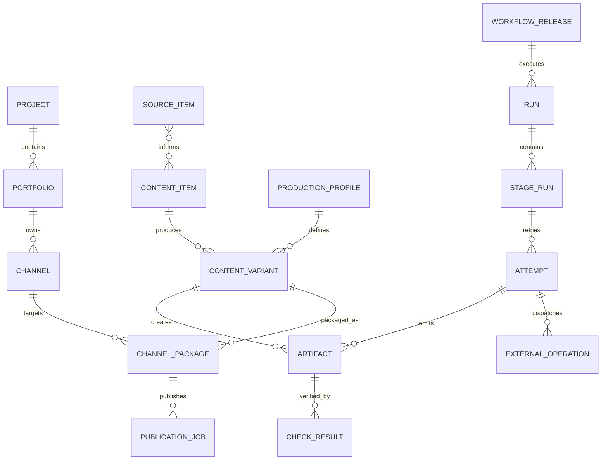
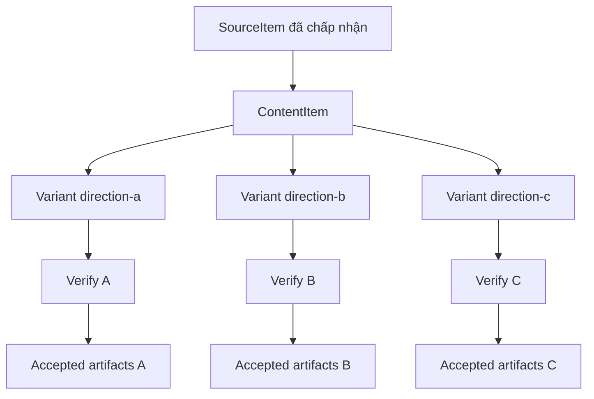
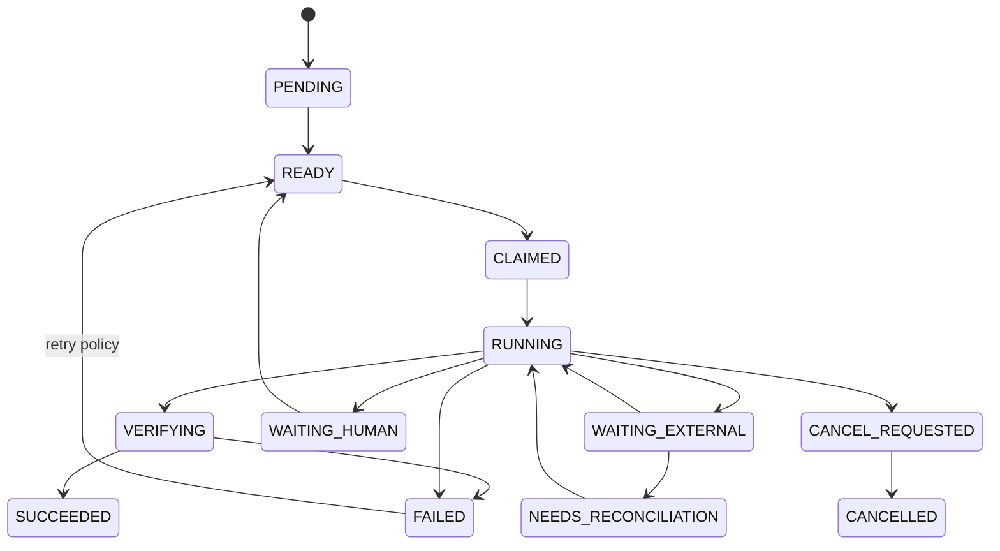

# YOUTUBE OPERATIONS HARNESS — KIẾN TRÚC THAM CHIẾU v1.0

> **Trạng thái:** Baseline để xây dựng hệ thống mới  
> **Phạm vi:** Nhiều hướng sản xuất, nhiều kênh YouTube, nhiều worker/session và lịch chạy tự động  
> **Đối tượng:** Agent triển khai, người vận hành và người duyệt release  
> **Tài liệu đi kèm:** `YOUTUBE_OPERATIONS_HARNESS_MIGRATION_SPEC.md` dùng khi chuyển hệ thống đang chạy sang kiến trúc này

---

## 1. Mục tiêu

Tài liệu này định nghĩa cấu trúc chuẩn cho một **YouTube Operations Harness**: nền tảng điều phối toàn bộ chuỗi từ kho source thô đến sản xuất biến thể nội dung, hoàn thiện video, tạo thumbnail, SEO, lên lịch, upload, theo dõi và phục hồi lỗi cho nhiều kênh.

Harness không phải một coding agent và cũng không phải một session Codex. Nó là lớp phần mềm vận hành các agent, script, API và công cụ media theo một quy trình có trạng thái, có kiểm chứng và có thể truy vết.

Hệ thống phải đạt các mục tiêu:

1. Một source có thể tạo nhiều hướng nội dung A/B/C mà không ghi đè lẫn nhau.
2. Nhiều worker hoặc Codex session có thể xử lý song song mà không tranh chấp công việc.
3. Một hoặc nhiều worker phân phối có thể phục vụ 5–10 kênh hoặc nhiều hơn.
4. Mỗi đầu ra truy ngược được source, profile, workflow, công cụ và phiên bản đã tạo ra nó.
5. Scheduled task chạy được mà không cần ký ức của chat trước.
6. Lỗi có thể retry, reconcile, resume hoặc chuyển sang xử lý thủ công mà không tạo upload hay chi phí trùng.
7. Quy trình và template có thể nâng cấp theo release, canary, migration và rollback.
8. Dữ liệu riêng của dự án/kênh tách khỏi mã lõi dùng chung.

### 1.1 Ngoài phạm vi baseline

- Không xây microservices ngay từ đầu.
- Không lưu video/audio lớn trực tiếp trong Git.
- Không coi nội dung hội thoại là kho trạng thái chính thức.
- Không tự động sửa trực tiếp bản production đang chạy khi chưa qua test và kích hoạt release.
- Không gắn logic nghiệp vụ với tên `SS1`, `SS2`, `SS3` hoặc ID session cụ thể.

---

## 2. Quyết định kiến trúc cốt lõi

### 2.1 Project là biên dài hạn; session là worker tạm thời

Tạo project theo ranh giới trách nhiệm và vòng đời dữ liệu. Không tạo kiến trúc theo số lượng session.

| Khái niệm | Vòng đời | Vai trò |
|---|---:|---|
| Harness project | Dài hạn | Mã lõi, contract, workflow, policy, adapter, test, release |
| Operations project/portfolio | Dài hạn | Cấu hình dự án, kênh, lịch, profile được phép dùng, quota |
| Run workspace | Ngắn hạn | Scratch space cô lập cho một stage attempt |
| Codex session/task | Tạm thời | Worker tương tác hoặc bảo trì hệ thống |
| Scheduled run | Tạm thời | Một lần kích hoạt worker theo lịch |

Ánh xạ cách vận hành hiện tại:

| Cách gọi hiện tại | Vai trò chuẩn trong harness |
|---|---|
| SS1 sản xuất hướng A | `producer` + `production_profile=direction-a` |
| SS2 sản xuất hướng B | `producer` + `production_profile=direction-b` |
| SS3 sản xuất hướng C | `producer` + `production_profile=direction-c` |
| SS4 nối/edit/thumbnail/SEO/upload | Các worker `finisher`, `thumbnailer`, `seo`, `publisher` |
| Session sửa quy trình | `maintainer` làm trên candidate release |
| Session cập nhật template | `template-curator` nâng cấp template chuẩn |

Một session có thể giữ một vai trò để dễ theo dõi, nhưng mọi lần chạy phải nhận task từ state store và ghi kết quả có cấu trúc. Khi session mất hoặc được thay mới, worker khác phải tiếp tục được.

### 2.2 Hai lớp project chính

Khuyến nghị tối thiểu:

```text
youtube-operations-harness/       # sản phẩm nền tảng dùng chung
youtube-content-operations/       # cấu hình và vận hành portfolio/kênh
```

Khi các nhóm nội dung có quyền, chu kỳ release hoặc nghiệp vụ rất khác nhau, tách operations project theo portfolio:

```text
youtube-finance-operations/
youtube-history-operations/
youtube-entertainment-operations/
```

Không duy trì một clone template sống song song cho từng dự án. Mỗi dự án tham chiếu một **template release bất biến**; thay đổi phổ quát được hợp nhất vào template chuẩn rồi phát hành phiên bản mới.

### 2.3 Modular monolith trước

Baseline là modular monolith có CLI/API và worker process. Các module có contract rõ nhưng cùng nằm trong một codebase và có thể dùng chung state store. Chỉ tách service khi có bằng chứng về tải, quyền truy cập hoặc nhu cầu triển khai độc lập.

---

## 3. Sơ đồ hệ thống

```mermaid
flowchart LR
    SRC[Kho source thô] --> CAT[Source Catalog]
    CAT --> PLAN[Planner / Orchestrator]
    PLAN --> QA[Queue hướng A]
    PLAN --> QB[Queue hướng B]
    PLAN --> QC[Queue hướng C]
    QA --> PA[Producer A]
    QB --> PB[Producer B]
    QC --> PC[Producer C]
    PA --> AR[(Artifact Store)]
    PB --> AR
    PC --> AR
    AR --> FIN[Finishing]
    FIN --> TH[Thumbnail]
    TH --> SEO[SEO Metadata]
    SEO --> PUB[Publisher]
    PUB --> YT[YouTube channels]
    CFG[Portfolio + Channel Config] --> PLAN
    REG[Workflow/Profile Registry] --> PLAN
    ST[(State Store)] <--> PLAN
    ST <--> PUB
    OBS[Events / Metrics / Cost] <-- PLAN
    OBS <-- PUB
```

Lineage chuẩn:

```text
SourceItem
  -> ContentItem
    -> ContentVariant(direction-a | direction-b | direction-c)
      -> AcceptedArtifactSet
        -> ChannelPackage(channel-x)
          -> PublicationJob
            -> YouTube video ID
```

---

## 4. Cấu trúc repository chuẩn

```text
youtube-operations-harness/
├── AGENTS.md
├── README.md
├── pyproject.toml                  # hoặc package.json; một stack chính
├── configs/
│   ├── harness.yaml               # cấu hình lõi có version
│   ├── profiles/                  # local, test, production
│   └── schemas/                   # schema cho config công khai
├── src/harness/
│   ├── contracts/                 # kiểu dữ liệu, schema, error, interface
│   ├── orchestration/             # state machine, planner, scheduler, recovery
│   ├── source_catalog/            # đăng ký source, checksum, quyền sử dụng
│   ├── production/                # logic tạo ContentVariant
│   ├── distribution/              # ChannelPackage và PublicationJob
│   ├── channels/                  # đọc/kiểm tra/phân giải hồ sơ kênh
│   ├── context/                   # dựng context theo stage, retrieval, compaction
│   ├── policy/                    # allow/deny/approval/quota/budget
│   ├── executors/                 # chạy agent, script, media/external job
│   ├── adapters/                  # YouTube, LLM, TTS, image, render, storage
│   ├── environment/               # workspace, sandbox, process, filesystem
│   ├── state/                     # transaction, repository, lease, migration
│   ├── artifacts/                 # manifest, lineage, registry, invalidation
│   ├── verification/              # checker, acceptance criteria, verdict
│   ├── observability/             # event, log, trace, metric, cost
│   ├── interfaces/                # CLI/API/event-stream entry points
│   └── composition.py             # nối implementation tại composition root
├── workflows/
│   ├── source-ingestion/
│   ├── video-production/
│   ├── video-finishing/
│   ├── thumbnail-generation/
│   ├── seo-metadata/
│   ├── youtube-publishing/
│   └── failure-remediation/
├── production-profiles/
│   ├── direction-a/
│   ├── direction-b/
│   └── direction-c/
├── project-template/
│   ├── project.yaml
│   ├── channels/
│   ├── schedules/
│   ├── policies/
│   └── overrides/
├── .agents/skills/                # skill theo repo cho Codex
├── migrations/                    # schema/config/artifact migrations
├── releases/                      # manifest và compatibility của release
├── fixtures/                      # dữ liệu test nhỏ, có quyền sử dụng
├── tests/                         # contract/unit/integration/recovery
├── evals/                         # chất lượng nội dung và hành vi agent
└── docs/
    ├── architecture/
    ├── runbooks/
    ├── adr/
    └── operations/
```

### 4.1 Ranh giới trách nhiệm

| Vùng | Chứa gì | Không chứa gì |
|---|---|---|
| `src/harness/` | Mã lõi có thể kiểm thử và phát hành | Cấu hình riêng của kênh |
| `workflows/` | DAG, stage definition, input/output contract | File media runtime |
| `production-profiles/` | Quy tắc biến đổi source theo hướng A/B/C | Secret và OAuth token |
| `project-template/` | Skeleton tạo operations project | Bản clone sống của mọi dự án |
| `.agents/skills/` | Hướng dẫn/script tái sử dụng cho Codex | State của run |
| `tests/` | Kiểm tra hành vi kỹ thuật xác định được | Đánh giá cảm tính nội dung |
| `evals/` | Dataset/rubric đánh giá nội dung và agent | Thay acceptance check kỹ thuật |
| `releases/` | Manifest, compatibility, migration link | Binary/video lớn |

### 4.2 Quy tắc dependency

1. `contracts` không phụ thuộc module nghiệp vụ khác.
2. `orchestration` gọi interface trong `contracts`; adapter cụ thể được nối ở `composition`.
3. `production` và `distribution` không gọi trực tiếp SDK nhà cung cấp.
4. `adapters` chuyển contract nội bộ sang API bên ngoài.
5. `verification` chỉ tạo `CheckResult`/`Verdict`; không tự sửa artifact.
6. `observability` nhận event đã lọc secret; không quyết định trạng thái nghiệp vụ.
7. Không module nào đọc tùy ý thư mục module khác để suy đoán trạng thái.

---

## 5. Operations project và runtime data

```text
youtube-content-operations/
├── AGENTS.md
├── project.yaml
├── template.lock.yaml
├── portfolios/
│   └── portfolio-main/
│       ├── portfolio.yaml
│       ├── channels/
│       │   ├── channel-01.yaml
│       │   └── channel-02.yaml
│       ├── routing/distribution-rules.yaml
│       ├── schedules/
│       │   ├── production.yaml
│       │   └── publishing.yaml
│       ├── policies/
│       │   ├── editorial.yaml
│       │   ├── publication.yaml
│       │   └── budget.yaml
│       └── overrides/
├── source-catalog/
│   ├── sources.yaml
│   └── collections/
├── plans/                         # kế hoạch có review, lưu trong Git
├── reports/                       # báo cáo nhỏ; không phải event log đầy đủ
└── .agents/skills/                # skill riêng của project nếu cần
```

`channels/` ở operations project chứa **dữ liệu cấu hình kênh**. `src/harness/channels/` ở harness project chứa **mã xử lý cấu hình kênh**.

Runtime data nằm ngoài Git:

```text
youtube-operations-data/
├── sources/
│   ├── raw/                       # có thể mount/link đến kho source hiện có
│   ├── normalized/
│   └── indexes/
├── workspaces/<run-id>/<stage-id>/<attempt-id>/
├── artifacts/<content-id>/<variant-id>/<artifact-id>/
├── publications/<channel-id>/<publication-job-id>/
├── state/                         # DB hoặc service state
├── logs/
├── incidents/
└── archives/
```

Video, audio và ảnh lớn có thể nằm trên local disk, NAS hoặc object storage. State store chỉ lưu URI, checksum, dung lượng, MIME type, revision và lineage.

---

## 6. Mô hình miền chuẩn

| Entity | Ý nghĩa | Trường định danh tối thiểu |
|---|---|---|
| `Project` | Operations project | `project_id`, `template_release` |
| `Portfolio` | Nhóm kênh dùng chung chiến lược/quyền | `portfolio_id`, `project_id` |
| `Channel` | Kênh và hồ sơ xuất bản | `channel_id`, `account_ref`, `config_revision` |
| `SourceItem` | Source thô đã đăng ký | `source_id`, `uri`, `checksum`, `rights_status` |
| `ContentItem` | Nội dung logic sinh từ source | `content_id`, `source_ids`, `revision` |
| `ProductionProfile` | Hướng A/B/C và quy tắc sản xuất | `profile_id`, `profile_revision` |
| `ContentVariant` | Biến thể theo profile | `variant_id`, `content_id`, `profile_revision` |
| `DistributionPlan` | Variant đi kênh nào, khi nào | `plan_id`, `revision` |
| `ChannelPackage` | Video + thumbnail + metadata khóa cho kênh | `package_id`, `channel_id`, `manifest_digest` |
| `PublicationJob` | Một lần publish có kiểm soát | `publication_job_id`, `package_id`, `idempotency_key` |
| `WorkflowRelease` | Workflow bất biến đã phát hành | `workflow_id`, `version`, `digest` |
| `Run` | Một execution của workflow | `run_id`, `workflow_release`, `config_snapshot` |
| `StageRun` | Một node logic trong Run | `stage_run_id`, `stage_key`, `state` |
| `Attempt` | Một lần thử StageRun | `attempt_id`, `lease_token`, `started_at` |
| `Artifact` | Đầu ra có manifest và checksum | `artifact_id`, `type`, `checksum`, `status` |
| `ExternalOperation` | Tác động bên ngoài/chi phí | `operation_id`, `provider`, `idempotency_key`, `status` |
| `CheckResult` | Kết quả kiểm tra định danh | `check_id`, `checker_version`, `verdict`, `evidence` |
| `Incident` | Sự cố cần điều tra/phục hồi | `incident_id`, `severity`, `run_id`, `status` |

### 6.1 Quan hệ



ID là bất biến; không dùng tên hiển thị làm khóa. Revision tăng khi nội dung/config đổi; checksum phản ánh byte hoặc canonical payload. Mọi timestamp lưu UTC, timezone chỉ dùng khi hiển thị hoặc tính lịch.

---

## 7. Contract thực thi

Mọi stage có input/output theo schema. Không dùng câu trả lời văn bản của agent làm bằng chứng duy nhất rằng stage thành công.

### 7.1 `StageRequest`

```yaml
schema_version: harness.stage-request/v1
run_id: run_...
stage_run_id: stage_...
attempt_id: attempt_...
project_id: project_...
portfolio_id: portfolio_...
workflow:
  id: video-production
  version: 1.2.0
  digest: sha256:...
profile_snapshot:
  id: direction-a
  revision: 7
inputs:
  - artifact_id: artifact_...
    checksum: sha256:...
workspace_uri: file:///.../workspaces/run/stage/attempt
limits:
  deadline_at: 2026-09-10T10:00:00Z
  max_cost_usd: 5.00
  max_attempts: 3
capabilities: [read_source, write_workspace, call_tts]
```

### 7.2 `StageResult`

```yaml
schema_version: harness.stage-result/v1
attempt_id: attempt_...
outcome: succeeded              # succeeded | failed | deferred | unknown
outputs:
  - path: output/final.mp4
    type: video/mp4
    checksum: sha256:...
checks:
  - check_id: video-probe
    verdict: pass
usage:
  wall_seconds: 712
  cost_usd: 1.84
external_operations: []
errors: []
```

Controller chỉ commit `SUCCEEDED` khi request/result đúng schema, output tồn tại và checksum khớp, acceptance check bắt buộc đều pass, attempt vẫn giữ fencing token hợp lệ và artifact manifest được commit nguyên tử.

### 7.3 `ArtifactManifest`

```yaml
schema_version: harness.artifact/v1
artifact_id: artifact_...
type: final_video
status: accepted
uri: file:///.../artifacts/...
checksum: sha256:...
size_bytes: 123456789
created_by:
  run_id: run_...
  stage_run_id: stage_...
  attempt_id: attempt_...
lineage:
  input_artifacts: [artifact_source_...]
  source_items: [source_...]
reproducibility:
  workflow_release: video-production@1.2.0
  production_profile: direction-a@7
  channel_config_revision: null
  executor_version: media-renderer@2.1.0
  model_parameters_digest: sha256:...
checks: [check_...]
```

---

## 8. Workflow chuẩn

### 8.1 Ingest source

```text
discover -> fingerprint -> rights_check -> normalize_metadata
         -> deduplicate -> catalog_commit
```

Source catalog lưu URI, checksum, nguồn gốc, quyền sử dụng, ngôn ngữ, thời lượng, ngày nhập và trạng thái khả dụng. Không copy mọi source vào Git.

### 8.2 Sản xuất theo nhiều hướng



Mỗi variant có workspace, lineage và artifact riêng. Production profile khai báo khán giả, ngôn ngữ, giọng điệu, độ dài, prompt/skill/workflow revision, công cụ/model được phép, quy tắc chọn source, acceptance criteria, budget, concurrency và policy tái sử dụng giữa các kênh.

### 8.3 Đóng gói và xuất bản

```text
accepted_content_variant
  -> finishing -> thumbnail_generation -> seo_metadata
  -> channel_policy_check -> channel_package_commit
  -> publication_schedule -> upload
  -> provider_processing_reconcile -> post_publish_verify
```

`ChannelPackage` pin checksum video/thumbnail, revision metadata, channel config snapshot, account reference, lịch/timezone, publication policy và các check. Worker phân phối chỉ đọc artifact `ACCEPTED`, không lấy file từ scratch folder đang được producer ghi.

### 8.4 Chữa lỗi tự động

```text
detect -> classify -> reproduce -> isolate -> patch
       -> test -> candidate_release -> canary -> activate_or_rollback
```

Remediation có thể retry lỗi tạm thời theo policy. Thay đổi code, workflow hoặc template phải tạo candidate release. Thay đổi nội dung, kênh, quyền hoặc chi phí vượt ngưỡng phải qua human gate.

---

## 9. State machine

### 9.1 Run

```text
DRAFT -> READY -> RUNNING -> SUCCEEDED | FAILED
                    |-> WAITING -> RUNNING
                    |-> CANCEL_REQUESTED -> CANCELLED
```

### 9.2 StageRun



Artifact: `PROVISIONAL -> ACCEPTED | REJECTED`; artifact accepted có thể thành `STALE` hoặc `ARCHIVED`.

Publication: `DRAFT -> READY -> SCHEDULED -> UPLOADING -> PROCESSING -> PUBLISHED`; khi kết quả không rõ chuyển `NEEDS_RECONCILIATION`, không tự suy đoán thất bại.

Mọi transition được controller kiểm tra và ghi cùng event trong một transaction. Worker không tự sửa file đánh dấu trạng thái.

---

## 10. Đồng thời, lease và scheduler

### 10.1 Claim công việc

1. Chọn `StageRun=READY` phù hợp capability và quota.
2. State store tạo `Attempt` cùng `lease_owner`, `lease_expires_at`, `fencing_token`.
3. Worker heartbeat trong thời gian chạy.
4. Nếu lease hết, attempt thành `ABANDONED`; token cũ không được commit kết quả.
5. Retry tạo attempt và workspace mới.

Giới hạn đồng thời phải áp dụng ở cấp hệ thống, provider, máy/GPU, account YouTube, channel, portfolio và run. Scheduler dùng fair queue để một portfolio không chiếm toàn bộ tài nguyên.

### 10.2 Scheduled task

Prompt scheduled task chỉ đóng vai trò kích hoạt. Nguồn sự thật vẫn là workflow release, project config và state store. Mỗi lần chạy:

```text
load pinned config -> inspect queue -> claim bounded work
-> execute -> verify -> commit -> report actionable result
```

Job sản xuất hằng ngày nên dùng run mới và context sạch. Job theo dõi sự cố có thể tiếp tục cùng task, nhưng vẫn phải đọc state bền vững.

---

## 11. External effect và chống chạy trùng

Upload, gọi dịch vụ trả phí, publish, xóa hoặc thay metadata là external effect. Trước khi dispatch:

1. Ghi `ExternalOperation=INTENT_RECORDED`.
2. Sinh idempotency key từ loại tác vụ + target + input revision.
3. Gửi yêu cầu và lưu provider job ID/receipt ngay khi có.
4. Nếu mất kết nối sau khi gửi, đặt `NEEDS_RECONCILIATION`.
5. Reconcile với provider trước khi retry.

Không blind retry upload hoặc tác vụ trả phí khi kết quả chưa rõ. Khóa upload gợi ý:

```text
sha256(channel_id + video_checksum + metadata_revision + publish_slot)
```

Sau publish, lưu YouTube video ID, trạng thái xử lý, URL, thời điểm, channel ID, package digest và receipt/evidence.

---

## 12. Lineage, invalidation và cache

Mỗi artifact biết input trực tiếp và source gốc. Khi input/config đổi, hệ thống đánh dấu output phụ thuộc là `STALE` theo graph:

- đổi script làm voiceover, subtitle, render và SEO phụ thuộc nội dung thành stale;
- chỉ đổi thumbnail không làm video stale;
- đổi channel title policy chỉ làm metadata/package của kênh đó stale;
- nâng checker version có thể yêu cầu re-verify mà không tự làm artifact stale.

Cache key tối thiểu:

```text
hash(stage_definition_digest,
     input_artifact_checksums,
     effective_config_digest,
     executor_version,
     model_parameters_digest)
```

Chỉ tái sử dụng cache khi policy cho phép và toàn bộ dependency khớp.

---

## 13. Cấu hình, policy và secret

### 13.1 Thứ tự hợp nhất cấu hình

```text
system defaults
  -> workflow defaults
  -> production profile / portfolio overrides được phép
  -> channel overrides được phép
  -> run overrides được phép
  -> policy constraints bắt buộc
```

- Key không biết phải fail khi validate.
- Schema định nghĩa rõ `null`, danh sách là replace hay append và field nào được override.
- Sau khi resolve, lưu `effective_config_snapshot` bất biến cho Run.
- Secret không tham gia snapshot dưới dạng giá trị; chỉ lưu secret reference.

### 13.2 Các nhóm policy

| Policy | Ví dụ |
|---|---|
| Capability | Worker nào được upload, sửa config, gọi network |
| Editorial | Chủ đề cấm, claim cần nguồn, quy tắc nội dung trùng |
| Publication | Visibility, audience, lịch, quota kênh |
| Cost | Budget theo run/ngày/portfolio/provider |
| Retry | Lỗi nào retry, backoff, số lần tối đa |
| Approval | Bước nào cần người duyệt |
| Retention | Giữ workspace, artifact, log bao lâu |

### 13.3 Secret

- Config chỉ lưu `secret_ref`, không lưu token.
- Credential YouTube tách theo account/channel và cấp quyền tối thiểu.
- Không đưa secret vào prompt, event, log, artifact manifest hoặc Git.
- Log phải redaction trước khi persist.

---

## 14. Profile và channel schema mẫu

### 14.1 Production profile

```yaml
schema_version: harness.production-profile/v1
profile_id: direction-a
revision: 7
status: active
workflow_release: video-production@1.2.0
audience:
  language: vi
  description: khán giả mục tiêu của hướng A
content:
  target_duration_seconds: [480, 720]
  narrative_style: profile-defined
source_selection:
  allowed_collections: [main]
  max_source_age_days: null
tools:
  allowed_adapters: [llm-main, tts-main, renderer-main]
verification:
  required_checks:
    - script-structure
    - duration-range
    - audio-integrity
    - video-probe
limits:
  max_cost_usd_per_variant: 5.0
  max_concurrency: 2
```

### 14.2 Channel profile

```yaml
schema_version: harness.channel/v1
channel_id: channel-01
config_revision: 12
display_name: Example Channel
portfolio_id: portfolio-main
youtube:
  account_ref: secret://youtube/channel-01
  expected_channel_id: UC...
publication:
  timezone: Asia/Bangkok
  visibility: private
  allowed_profiles: [direction-a, direction-b]
  max_daily_uploads: 2
  require_human_approval_for_public: true
metadata:
  default_language: vi
  category_id: "27"
verification:
  required_checks:
    - channel-identity
    - package-integrity
    - duplicate-upload
```

Các schema trên là mẫu khởi đầu. Implementation phải tạo schema máy đọc được và validation test tương ứng.

---

## 15. Quan sát, chi phí và sự cố

Mỗi event cần các correlation field:

```text
event_id, occurred_at, run_id, stage_run_id, attempt_id,
project_id, portfolio_id, channel_id, content_id, variant_id,
workflow_release, severity, event_type
```

Không ghi raw prompt/response theo mặc định nếu có nguy cơ chứa secret hoặc dữ liệu nhạy cảm. Có thể lưu digest và bản đã redaction.

Báo cáo vận hành tối thiểu:

- throughput theo ngày/profile/channel;
- queue depth và tuổi job;
- tỷ lệ thành công/retry/reconciliation;
- chi phí theo content variant, kênh và provider;
- thời gian từng stage;
- artifact stale/rejected;
- upload trùng bị ngăn;
- incident đang mở và release liên quan.

Incident liên kết run, stage, artifact, external operation và release. Runbook phải có cách reconcile upload, xử lý hết quota, sai account, render hỏng, source mất và rollback release.

---

## 16. Release, template và nâng cấp

### 16.1 Version bắt buộc

| Đối tượng | Cách version |
|---|---|
| Harness code | Semantic version + Git commit |
| Workflow | ID + semantic version + digest |
| Production profile | Revision bất biến |
| Channel config | Revision bất biến |
| Project template | Semantic version + digest |
| Schema | `schema_version` và migration |
| Executor/adapter/checker | Package version hoặc image digest |

Mỗi Run pin toàn bộ phiên bản cần để giải thích kết quả.

### 16.2 Cập nhật template hằng tuần

Template curator đọc thay đổi đã xác minh từ các dự án và phân loại:

1. **Project-only:** chỉ giữ ở dự án đó.
2. **Profile/portfolio:** đưa vào profile hoặc cấu hình nhóm.
3. **Universal:** đề xuất vào harness hoặc project template chuẩn.

Thay đổi universal đi qua:

```text
proposal -> tests/evals -> candidate template release
-> canary project -> compatibility check -> active release
```

Project đang chạy giữ `template.lock.yaml` và chỉ nâng cấp có chủ ý. Bản cũ lưu bằng Git tag/release package kèm digest, compatibility, migration và test report. ZIP có thể dùng sao lưu, không phải cơ chế version chính.

### 16.3 Rollback

- Rollback code/workflow không được xóa state mới.
- Migration có forward compatibility hoặc kế hoạch restore rõ.
- Run đang chạy tiếp tục dùng release đã pin nếu release đó còn được hỗ trợ.
- Candidate lỗi bị disable; queue mới quay về active release trước.

---

## 17. Tích hợp Codex

### 17.1 AGENTS.md và skill

`AGENTS.md` ở root chứa nguyên tắc ổn định cho mọi agent: cách tìm task, lệnh test, giới hạn quyền, quy tắc artifact, cách commit state và định nghĩa hoàn thành. Hướng dẫn dài hoặc theo workflow nằm trong `.agents/skills/<skill-name>/SKILL.md` cùng script/reference cần thiết.

```text
.agents/skills/
├── produce-direction-a/
├── produce-direction-b/
├── produce-direction-c/
├── build-channel-package/
├── publish-youtube/
├── reconcile-publication/
└── curate-template-release/
```

Theo tài liệu chính thức, skill là thư mục có `SKILL.md` và có thể kèm `scripts/`, `references/`, `assets/`; Codex có thể nạp skill theo repo từ `.agents/skills`. Skill đóng gói cách làm cho agent, còn state và transaction vẫn thuộc harness. Xem [Build skills](https://learn.chatgpt.com/docs/build-skills).

### 17.2 SDK, App Server và scheduled task

- Dùng **Codex SDK** nếu harness cần gọi Codex có lập trình trong job hoặc workflow. Tài liệu chính thức định vị SDK cho CI/CD, internal tools và workflow tích hợp: [Codex SDK](https://learn.chatgpt.com/docs/codex-sdk).
- Dùng **App Server** khi cần xây client quản lý auth, lịch sử hội thoại, approval và event streaming. Tài liệu App Server khuyên dùng SDK cho job automation/CI: [Codex App Server](https://learn.chatgpt.com/docs/app-server).
- Scheduled task của desktop có thể chạy trong project local hoặc worktree; máy và ứng dụng phải hoạt động khi job cần file local. Prompt cần bền vững, nên gọi skill cụ thể và đọc state store khi bắt đầu: [Scheduled tasks](https://learn.chatgpt.com/docs/automations).

### 17.3 Nguyên tắc dùng session

1. Session không sở hữu dữ liệu duy nhất.
2. Mở session mới bằng role brief + project path + queue selector, không cần chép toàn bộ chat cũ.
3. Session tương tác có thể xử lý nhiều task nhưng mỗi task vẫn tạo Run/Stage/Attempt.
4. Scheduled worker dùng context nhỏ theo job.
5. Session bảo trì code dùng branch/worktree riêng và không chạy trên artifact workspace production.

---

## 18. Kiểm thử và eval

### 18.1 Test kỹ thuật bắt buộc

- schema/contract compatibility;
- state transition hợp lệ và transition bị cấm;
- atomic claim khi nhiều worker tranh cùng job;
- fencing token chặn worker hết lease;
- retry, backoff, cancellation và resume sau crash;
- external operation reconciliation;
- artifact checksum, lineage và invalidation;
- config precedence và unknown-key rejection;
- secret redaction;
- channel/account identity trước upload;
- duplicate publication prevention;
- migration và rollback compatibility.

### 18.2 Eval chất lượng

- profile A/B/C tạo khác biệt mong muốn;
- script đúng giọng, độ dài và cấu trúc;
- thumbnail đúng brand và dễ đọc;
- metadata phù hợp nội dung, không bịa claim;
- lựa chọn source đúng policy;
- output ổn định qua candidate release.

Eval không thay acceptance check kỹ thuật. Video hay vẫn phải pass codec, duration, file integrity và channel policy.

### 18.3 Acceptance cấp hệ thống

1. Ba worker cùng lấy queue nhưng chỉ một worker claim mỗi stage.
2. Worker chết giữa render; lease hết và worker mới chạy lại an toàn.
3. Worker cũ quay lại không thể commit artifact.
4. Upload mất kết nối sau dispatch không tạo video thứ hai.
5. Worker phân phối không đọc artifact còn `PROVISIONAL`.
6. Thay script làm downstream artifact đúng phạm vi thành `STALE`.
7. Thay thumbnail không render lại video.
8. Sai `expected_channel_id` chặn upload.
9. Vượt daily budget chuyển job sang trạng thái chờ phù hợp.
10. Unknown config key làm validation thất bại trước khi chạy.
11. Secret không xuất hiện trong snapshot, event hoặc log.
12. Run cũ vẫn giải thích được sau khi profile nâng revision.
13. Candidate release lỗi chỉ ảnh hưởng canary.
14. Rollback không mất publication receipt.
15. Scheduled run mới hoạt động khi không có lịch sử chat.
16. Project nâng template release có migration report và quay lại release trước được.

---

## 19. Lộ trình xây dựng

### Giai đoạn 0 — Inventory và freeze contract

- liệt kê workflow hiện có, script, tool, kênh và source location;
- định nghĩa ID convention và schema v1;
- xác định secret store, data root và backup;
- tạo fixtures nhỏ đại diện cho A/B/C.

**Đạt khi:** một content item hiện có được mô tả đầy đủ bằng entity và artifact manifest mà chưa cần chạy lại.

### Giai đoạn 1 — Control plane tối thiểu

- contracts, state store, migrations;
- Run/StageRun/Attempt state machine;
- atomic claim, lease, heartbeat, cancellation;
- CLI: `plan`, `enqueue`, `claim`, `run`, `status`, `retry`, `reconcile`;
- structured event và artifact manifest.

**Đạt khi:** hai worker cạnh tranh một task mà không xử lý trùng và có thể resume sau crash.

### Giai đoạn 2 — Source và production fan-out

- source catalog;
- production profile A/B/C;
- isolated workspace;
- artifact verification và lineage;
- cost/resource accounting.

**Đạt khi:** một source tạo ba variant được kiểm chứng và truy vết độc lập.

### Giai đoạn 3 — Distribution và publishing

- channel profile và credential refs;
- finishing, thumbnail, SEO, packaging;
- publication schedule;
- idempotent upload + reconcile + post-publish verify.

**Đạt khi:** một package publish đúng kênh, retry sau lỗi mạng không upload trùng.

### Giai đoạn 4 — Codex skills và scheduled operations

- repo skills cho producer/distributor/maintainer;
- durable prompts;
- lịch production/publishing/reconciliation;
- alert và human gate.

**Đạt khi:** scheduled run mới chạy từ state bền vững, không cần lịch sử session.

### Giai đoạn 5 — Release/template governance

- project template release;
- weekly curation;
- candidate/canary/activation/rollback;
- compatibility matrix và migration report.

**Đạt khi:** nâng template cho canary project rồi rollback không mất state hoặc artifact.

### Giai đoạn 6 — Tối ưu quy mô

- queue fairness và resource reservation;
- chuyển SQLite/file store sang Postgres/object store nếu số liệu tải yêu cầu;
- dashboard SLO/cost;
- tách worker pool theo capability khi cần.

---

## 20. Stack tham chiếu nếu chưa chọn

Để bắt đầu trên một máy:

- Python 3.12 hoặc TypeScript; chọn theo code hiện có, không duy trì hai implementation lõi.
- SQLite WAL cho state store, filesystem/NAS cho artifact store.
- Process worker riêng, giao tiếp qua state store/queue abstraction.
- JSON Schema hoặc Pydantic/Zod cho contract.
- CLI là interface đầu tiên; API/UI thêm sau.
- Git tag + release manifest cho code/workflow/template.

Thiết kế repository interface ngay từ đầu để chuyển sang PostgreSQL và object storage được. Chỉ chuyển khi concurrency, dung lượng hoặc vận hành thực tế chứng minh cần thiết.

---

## 21. Definition of Done cho harness v1

Harness v1 đạt khi:

- Có repository và operations project đúng ranh giới trên.
- Có schema máy đọc được cho entity/contract chính.
- State machine và transaction được kiểm thử.
- Có CLI/API chạy end-to-end một source qua ít nhất hai profile đến channel package.
- Có artifact manifest, checksum, lineage và acceptance check.
- Có atomic claim, lease, heartbeat, retry, cancellation và resume.
- Có external operation journal và flow upload giả lập/reconcile không trùng.
- Có config precedence, policy engine tối thiểu và secret reference.
- Có event/cost/log đã redaction.
- Có release manifest, migration, canary và rollback runbook.
- Session Codex mới hoặc scheduled run nhận việc chỉ từ project path + role + queue selector.

---

## 22. Prompt bàn giao cho agent triển khai

Sao chép khối dưới đây cùng tài liệu này vào project mới:

```text
Bạn đang xây dựng YouTube Operations Harness mới theo tài liệu
YOUTUBE_OPERATIONS_HARNESS_BLUEPRINT_v1.0.md.

Mục tiêu là một modular monolith có control plane bền vững cho nhiều
production profile, nhiều kênh, nhiều worker và scheduled run.

Thực hiện theo thứ tự:
1. Inventory code/quy trình hiện có nếu có; không suy đoán interface.
2. Tạo repository tree tối thiểu, chỉ tạo thư mục khi có file thực.
3. Định nghĩa schema và contract trước implementation.
4. Xây state machine, atomic claim, lease/fencing và artifact manifest.
5. Tạo CLI end-to-end với adapter giả trước khi nối API trả phí/YouTube.
6. Thêm source catalog và production profile A/B/C.
7. Thêm distribution/channel package và publication reconciliation.
8. Thêm tests từ mục acceptance cấp hệ thống.
9. Tạo release manifest, migration và runbook.

Các invariant không được phá:
- Session chỉ là worker; state store là nguồn sự thật.
- Artifact chỉ được downstream dùng khi ACCEPTED.
- Run pin mọi revision cần để tái hiện và giải thích kết quả.
- External effect ghi intent và idempotency key trước dispatch.
- Kết quả không rõ phải reconcile trước retry.
- Secret chỉ xuất hiện dưới dạng secret reference.
- Thay đổi production đi qua candidate, test, canary và activate.

Sau mỗi giai đoạn, báo cáo file đã tạo, contract đã khóa, test đã chạy,
rủi ro còn lại và tiêu chí hoàn thành đã đạt. Không triển khai giai đoạn
sau nếu invariant của giai đoạn hiện tại chưa có test chứng minh.
```

---

## 23. Các quyết định không thay đổi tùy tiện

1. Kiến trúc theo project/workflow/profile, không theo session.
2. State và artifact là dữ liệu bền vững; chat là giao diện làm việc.
3. Fan-out A/B/C tạo variant riêng, không dùng chung output folder đang ghi.
4. Distribution nhận artifact accepted và tạo package riêng cho từng kênh.
5. Upload là external operation có idempotency và reconciliation.
6. Template là sản phẩm có release; không duy trì clone template sống theo dự án.
7. Mã lõi và dữ liệu operations nằm ở ranh giới project rõ ràng.
8. Modular monolith là baseline; scale bằng worker/process trước khi tách service.

---

## 24. Thuật ngữ

- **Harness:** nền tảng điều phối agent/tool/workflow và bảo đảm state, policy, kiểm chứng.
- **Workflow:** graph stage mô tả quy trình có version.
- **Profile:** biến thể cấu hình sản xuất như hướng A/B/C.
- **Worker:** process, agent hoặc session có capability nhận và xử lý task.
- **Run:** một lần thực thi workflow.
- **Attempt:** một lần thử cụ thể của stage.
- **Artifact:** đầu ra có manifest, checksum, trạng thái và lineage.
- **ChannelPackage:** artifact và metadata đã khóa cho một kênh.
- **Reconciliation:** đối chiếu với hệ thống ngoài khi kết quả dispatch chưa rõ.
- **Fencing token:** token tăng dần chặn worker hết lease ghi kết quả muộn.
- **Candidate release:** phiên bản đang kiểm thử, chưa phải active production release.

---

**Kết luận kiến trúc:** xây hệ thống như một **multi-channel content operations harness** có control plane bền vững. Session A/B/C và session phân phối là worker chuyên môn hóa có thể thay thế; project, workflow release, profile, state và artifact mới là cấu trúc cần bảo toàn.
